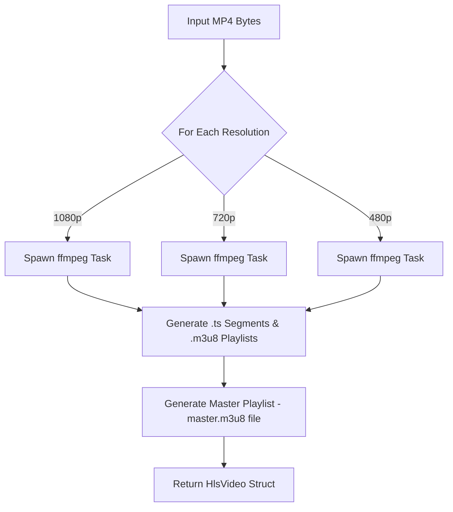

# HlsKit

**HlsKit** is a high-performance Rust library for transcoding MP4 videos into [HLS (HTTP Live Streaming)](https://developer.apple.com/streaming/) streams with adaptive bitrate support and multiple resolutions. It leverages `ffmpeg` under the hood and will soon support `gstreamer` as a pluggable backend.

Whether you're building a video streaming platform or need offline transcoding tools for video delivery, **HlsKit** provides an ergonomic, async-first API to handle the full conversion process: segmenting videos, creating resolution-specific playlists, and generating a master `.m3u8` playlist for adaptive streaming.

Wanna contribute? Check [CONTRIBUTING.md](./CONTRIBUTING.md)

---

## HlsKit 0.2.0 Released!!!
HlsKit now supports AES-128 HLS segment encryption by providing a key file and a custom initialization vector (IV).

To encrypt HLS segments first create a key with OpenSSL with the following command:

```bash
openssl rand 16 > hls.key
```

Now, instead of calling process_video(), you should call process_video_with_encrypted_segments()
Then just pass the following additional parameters:

- `encryption_key_url`: The public accessible URL to the key file.
- `encryption_key_path`: Path to the key file in the server.
- `iv`: Initialization vector for encryption (optional).

### Notes

The encryption key must be uploaded somewhere accessible by video players, we recommend using a secure storage service or a key server. The key also must be stored in the server where HlsKit is being used to transcode videos.

HlsKit uses `encryption_key_path` to locate the key file in the server and encrypt HLS Segments, and uses `encryption_key_url` to set the `base_url` property in m3u8 playlists, allowing video players to retrieve the encryption key to read the segments, any security measures should be taken to protect the key file from unauthorized access.

Using encrypted HLS segments provides an additional layer of security, making it more difficult for unauthorized users to access the video content but it is not a drop-in replacement for DRM systems. It is recommended to use encrypted HLS segments in conjunction with DRM systems for maximum security.
---

## 🌐 How It Works



---

## ✨ Features

- ✅ Convert MP4 videos to HLS format with multiple resolutions.
- ✅ Adaptive bitrate support via master playlist.
- ✅ Async-native using `tokio`.
- ✅ Configurable CRF-based encoding and speed presets.
- 🔜 Pluggable backends: GStreamer coming soon.

---

## 🚀 Usage Example

```rust
use std::{env, fs::File, io::Read};
use hlskit::{
    models::hls_video_processing_settings::{FfmpegVideoProcessingPreset, HlsVideoProcessingSettings},
    process_video,
};

#[tokio::main]
async fn main() -> Result<(), Box<dyn std::error::Error>> {
    let mut buf = Vec::new();
    File::open("src/sample.mp4")?.read_to_end(&mut buf)?;

    let result = process_video(
        buf,
        vec![
            HlsVideoProcessingSettings::new(
                (1920, 1080),
                28,
                None, // no custom audio code - defaulting to AAC
                None, // no custom audio bitrate
                FfmpegVideoProcessingPreset::Fast,
            ),
            HlsVideoProcessingSettings::new(
                (1280, 720),
                28,
                None, // no custom audio code - defaulting to AAC
                None, // no custom audio bitrate
                FfmpegVideoProcessingPreset::Fast,
            ),
            HlsVideoProcessingSettings::new(
                (854, 480),
                28,
                None, // no custom audio code - defaulting to AAC
                None, // no custom audio bitrate
                FfmpegVideoProcessingPreset::Fast,
            ),
        ],
    )
    .await?;

    println!("Master playlist:\n{}", String::from_utf8_lossy(&result.master_m3u8_data));
    Ok(())
}
```

---

## 🌍 Web Server Integration Example + S3 Upload

You can integrate **HlsKit** into an `axum` web server and upload results to Amazon S3:

```toml
# Cargo.toml
[dependencies]
hlskit = { git = "https://github.com/like-engels/hlskit-rs" }
axum = "0.7"
tokio = { version = "1", features = ["full"] }
aws-sdk-s3 = "0.30"
mime = "0.3"
uuid = { version = "1", features = ["v4"] }
```

```rust
use axum::{
    extract::Multipart,
    response::IntoResponse,
    routing::post,
    Router,
};
use aws_sdk_s3::Client as S3Client;
use hlskit::{
    models::hls_video_processing_settings::{FfmpegVideoProcessingPreset, HlsVideoProcessingSettings},
    process_video,
};
use std::net::SocketAddr;
use uuid::Uuid;

#[tokio::main]
async fn main() {
    let app = Router::new().route("/upload", post(upload));
    let addr = SocketAddr::from(([127, 0, 0, 1], 3000));
    println!("Server running at http://{}", addr);
    axum::Server::bind(&addr).serve(app.into_make_service()).await.unwrap();
}

async fn upload(mut multipart: Multipart) -> impl IntoResponse {
    let mut video_bytes = Vec::new();

    while let Some(field) = multipart.next_field().await.unwrap() {
        if field.name() == Some("video") {
            video_bytes = field.bytes().await.unwrap().to_vec();
            break;
        }
    }

    let profiles = vec![
        HlsVideoProcessingSettings {
            resolution: (1920, 1080),
            constant_rate_factor: 28,
            preset: FfmpegVideoProcessingPreset::Fast,
        },
        HlsVideoProcessingSettings {
            resolution: (1280, 720),
            constant_rate_factor: 28,
            preset: FfmpegVideoProcessingPreset::Fast,
        },
    ];

    match process_video(video_bytes, profiles).await {
        Ok(hls_video) => {
            let s3 = S3Client::new(&aws_config::load_from_env().await);
            let uuid = Uuid::new_v4().to_string();
            let bucket = "my-hls-videos";

            s3.put_object()
                .bucket(bucket)
                .key(format!("{}/master.m3u8", uuid))
                .body(hls_video.master_m3u8_data.into())
                .send()
                .await
                .unwrap();

            for resolution in hls_video.resolutions {
                s3.put_object()
                    .bucket(bucket)
                    .key(format!("{}/{}", uuid, resolution.playlist_name))
                    .body(resolution.playlist_data.into())
                    .send()
                    .await
                    .unwrap();

                for segment in resolution.segments {
                    s3.put_object()
                        .bucket(bucket)
                        .key(format!("{}/{}", uuid, segment.segment_name))
                        .body(segment.segment_data.into())
                        .send()
                        .await
                        .unwrap();
                }
            }

            format!("HLS stream uploaded to s3://{}/{}", bucket, uuid)
        }
        Err(e) => format!("Processing failed: {:?}", e),
    }
}
```

> ✅ Requires `AWS_ACCESS_KEY_ID`, `AWS_SECRET_ACCESS_KEY`, and `AWS_REGION` to be set in the environment.

---

## 📦 Installation

```toml
[dependencies]
hlskit = "0.2.0"
```

---

## 📌 Requirements

- Rust 1.85+
- FFmpeg must be installed in your system and available in `$PATH`

---

## 🛣️ Roadmap

- 🔄 GStreamer backend
- 📦 Crates.io publish
- 🧪 Comprehensive test coverage
- 💡 Custom audio profiles & watermarking
- 📄 Better documentation

---

## 🪪 License

HlsKit is licensed under LGPLv3. By modifying or distributing it (e.g., via forks or extensions), you agree to the HlsKit Contributor License Agreement (CLA), which ensures our ecosystem thrives.

The 'HlsKit' name and logo are trademarks of Engels Tercero. Use in forks or derivatives requires written permission.
